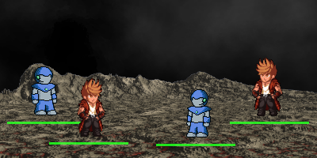

# Autexousious


<!-- TODO: Re-enable once we can test with coverage in Github -->
<!-- [](https://gitlab.com/azriel91/autexousious/commits/master) -->



Repository for the game *Will*, and supporting applications. These include:

* **Will:** 2.5D moddable action / adventure game.
* **Session Server:** Server to coordinate online play.

## Development

The applications in this repository are built on the [Amethyst game engine](https://github.com/amethyst/amethyst).

### Setup

1. Install [Rust](https://rustup.rs/).
2. Install [system dependencies](https://github.com/amethyst/amethyst#dependencies).
3. Clone this repository and the asset repository.

    ```bash
    git clone git@github.com:azriel91/autexousious.git
    cd autexousious
    mkdir assets
    git clone git@github.com:azriel91/will_assets.git assets/default
    ```

### Ongoing

* Running applications:

    ```bash
    # Will
    cargo run --bin will --release
    cargo run --bin will --release -- --session_server_address 127.0.0.1

    # Session server
    cargo run --bin session_server --release -- --address 127.0.0.1
    ```

* Running tests:

    ```bash
    # quieten output
    export AMETHYST_LOG_LEVEL_FILTER=WARN

    cargo test --workspace --tests -- --no-capture
    ```

## License

Licensed under either of

* Apache License, Version 2.0, ([LICENSE-APACHE](LICENSE-APACHE) or https://www.apache.org/licenses/LICENSE-2.0)
* MIT license ([LICENSE-MIT](LICENSE-MIT) or https://opensource.org/licenses/MIT)

at your option.

### Contribution

Unless you explicitly state otherwise, any contribution intentionally
submitted for inclusion in the work by you, as defined in the Apache-2.0
license, shall be dual licensed as above, without any additional terms or
conditions.
